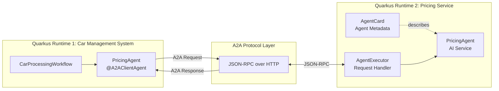
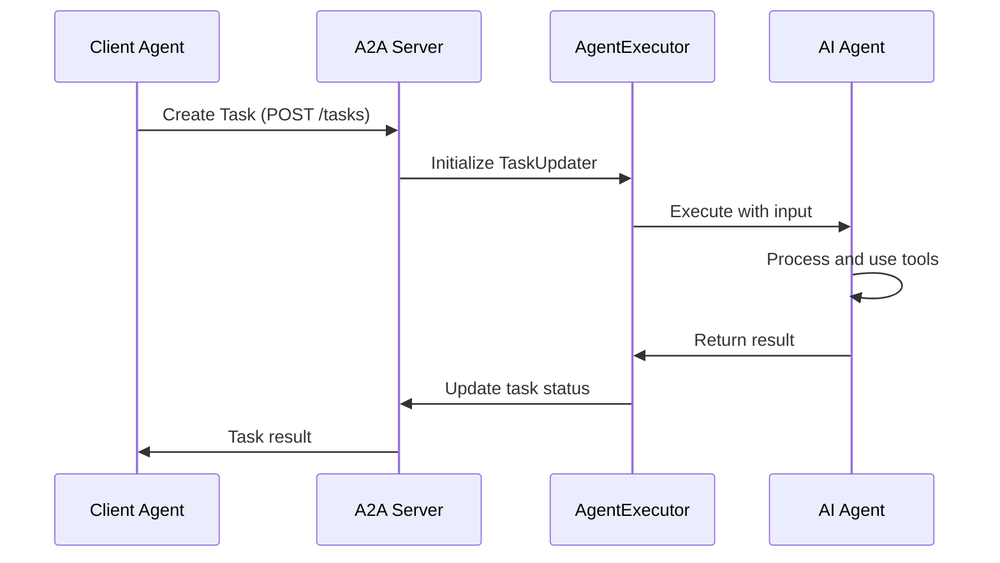
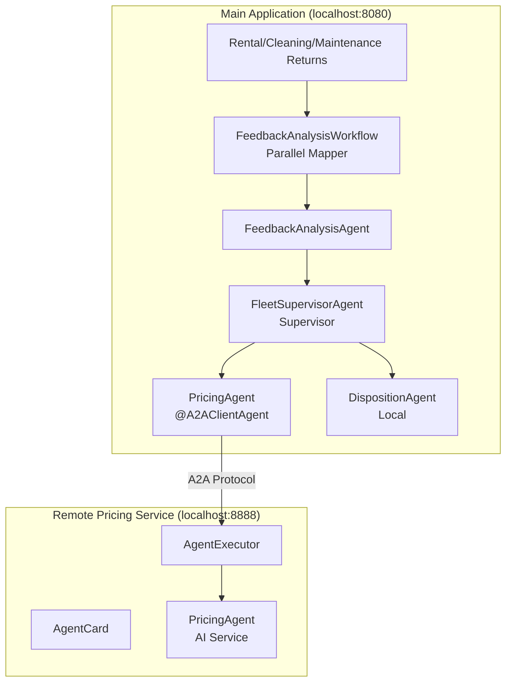
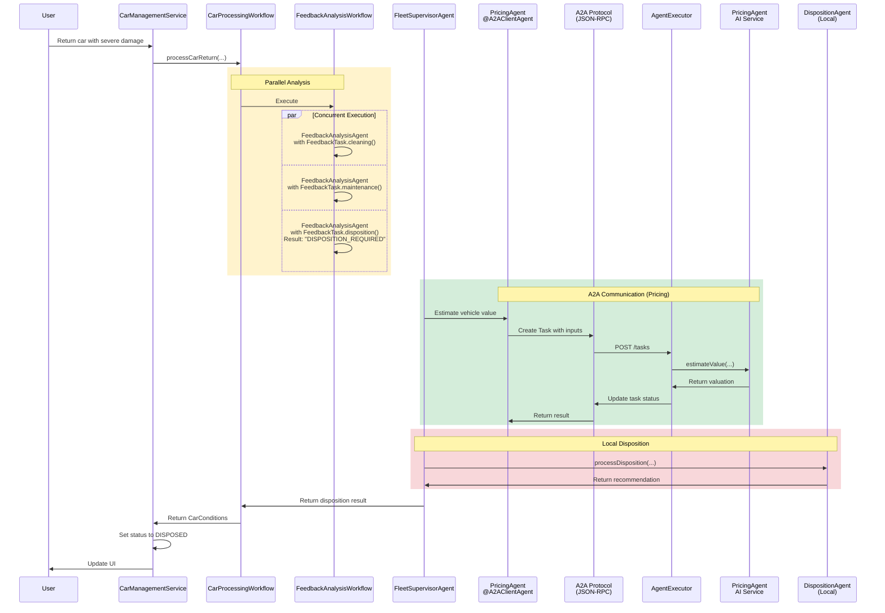

# Step 07 - Using Remote Agents (A2A)

## New Requirement: Distributing the Pricing Service

In the previous steps, you built a complete disposition system with the Supervisor Pattern (Step 4), Human-in-the-Loop approval (Step 5), and multimodal image analysis that enriches rental feedback with visual observations from car photos (Step 6). The system works well, but the Miles of Smiles management team has a new architectural requirement:

**The vehicle pricing logic needs to be maintained by a separate team and run as an independent service.**

This is a common real-world scenario where:

1. **Different teams own different capabilities**: The pricing team has specialized expertise in vehicle valuations and wants to maintain their own service
2. **The service needs to be reusable**: Multiple client applications (not just car management) might need pricing estimates
3. **Independent scaling is required**: The pricing service might need different resources than the main application

You'll learn how to convert the local `PricingAgent` into a remote service using the [**Agent-to-Agent (A2A) protocol**](https://a2a-protocol.org/){target="_blank"}.

---

## What You'll Learn

In this step, you will:

- Understand the [**Agent-to-Agent (A2A) protocol**](https://a2a-protocol.org/){target="_blank"} for distributed agent communication
- **Convert** the local `PricingAgent` into a remote A2A service
- Build a **client agent** that connects to remote A2A agents using `@A2AClientAgent`
- Create an **A2A server** that exposes an AI agent as a remote service
- Learn about **AgentCard**, **AgentExecutor**, and **TaskUpdater** components from the A2A SDK
- Understand the difference between **Tasks** and **Messages** in A2A protocol
- Run **multiple Quarkus applications** that communicate via A2A
- See the architectural trade-offs: lose Supervisor Pattern sophistication, gain distribution benefits

!!!note
   
    At the moment the A2A integration is quite low-level and requires some boilerplate code.
    The Quarkus LangChain4j team is working on higher-level abstractions to simplify A2A usage in future releases.

---

## Understanding the A2A Protocol

The [**Agent-to-Agent (A2A) protocol**](https://a2a-protocol.org/){target="_blank"} is an open protocol for AI agents to communicate across different systems and platforms. Just like any distributed system, its advantages are **Separation of concerns**, **Scalability**, **Reusability**, and also **Technology independence** since the agents could be implemented in different languages/frameworks. This also means that you can potentially create Java-based agents for a non-Java system, and vice-versa of course.

### A2A Architecture



!!!info "Additional A2A Info"
    For more information about the A2A protocol and the actors involved, see the [A2A documentation](https://a2a-protocol.org/latest/topics/key-concepts/#core-actors-in-a2a-interactions){target="_blank"}. 

---

## Understanding Tasks vs. Messages

The A2A protocol distinguishes between [two types of interactions](https://a2a-protocol.org/latest/topics/life-of-a-task/){target="_blank"}:

| Concept | Description | Use Case |
|---------|-------------|----------|
| **Task** | A long-running job with a defined goal and tracked state | "Estimate the market value of this vehicle" |
| **Message** | A single conversational exchange with no tracked state | Chat messages, quick questions |

In this step, we'll use **Tasks** because vehicle pricing is a discrete job with a clear objective.

**Task Lifecycle:**



---

## What Are We Going to Build?

We'll convert Step 5's architecture, but this time we'll convert the local `PricingAgent` to an A2A client; and we'll create a new Quarkus A2A server that will expose the logic of the original PricingAgent.

**The Complete Architecture:**



---

## Prerequisites

Before starting:

- **Completed [Step 06](step-06.md){target="_blank"}** - This step directly builds on Step 6's architecture
- Application from Step 06 is stopped (Ctrl+C)
- Ports 8080 and 8888 are available (you'll run two applications simultaneously)
- Understanding of Step 6's multimodal image analysis, Step 5's HITL Pattern, and Step 4's Supervisor Pattern (we keep the same patterns, just make PricingAgent remote)

---

## Understanding the Project Structure

The Step 07 code includes **two separate Quarkus applications**:

```
section-2/step-07/
├── multi-agent-system/          # Main car management application (port 8080)
│   ├── src/main/java/com/carmanagement/
│   │   ├── agentic/
│   │   │   ├── agents/
│   │   │   │   ├── PricingAgent.java              # A2A client agent
│   │   │   │   ├── DispositionAgent.java          # Local agent
│   │   │   │   ├── DispositionProposalAgent.java  # Creates proposals
│   │   │   │   ├── HumanApprovalAgent.java        # @HumanInTheLoop
│   │   │   │   └── FeedbackAnalysisAgent.java     # Parameterized feedback analyzer
│   │   │   └── workflow/
│   │   │       ├── FeedbackAnalysisWorkflow.java  # Parallel mapper analysis
│   │   │       └── CarProcessingWorkflow.java     # Main orchestrator
│   │   ├── model/
│   │   │   └── ApprovalProposal.java              # Approval entity
│   │   ├── resource/
│   │   │   └── ApprovalResource.java              # Approval REST endpoints
│   │   └── service/
│   │       └── ApprovalService.java               # Manages HITL workflow 
│   └── pom.xml
│
└── remote-a2a-agent/            # Remote pricing service (port 8888)
    ├── src/main/java/com/demo/
    │   ├── PricingAgentCard.java          # Describes agent capabilities
    │   ├── PricingAgentExecutor.java      # Handles A2A requests
    │   └── PricingAgent.java              # AI service for vehicle pricing
    └── pom.xml
```

---

=== "Option 1: Start Fresh from Step 07 [Recommended]"

    Navigate to the complete `section-2/step-07/multi-agent-system` directory:
    
    ```bash
    cd section-2/step-07/multi-agent-system
    ```

=== "Option 2: Continue from Step 06"

    Follow the steps below to convert the PricingAgent.
 

## Convert PricingAgent to A2A Client

The only back-end change needed in the main application is converting the `PricingAgent` from a local agent to an A2A client.

As a reminder, the `PricingAgent` had detailed pricing guidelines, depreciation tables, and an `@Output` post-processor. Now it becomes a simple client that delegates to the remote service. 

In `src/main/java/com/carmanagement/agentic/agents`, update `PricingAgent.java`:

```java title="PricingAgent.java"
--8<-- "../../section-2/step-07/multi-agent-system/src/main/java/com/carmanagement/agentic/agents/PricingAgent.java"
```

**Let's break it down:**

#### `@A2AClientAgent` Annotation

```java
@A2AClientAgent(a2aServerUrl = "http://localhost:8888")
```

This annotation transforms the method into an **A2A client**:

- **`a2aServerUrl`**: The URL of the remote A2A server

#### The Method Signature

```java
String estimateValue(String carMake, String carModel, Integer carYear, String carCondition)
```

These parameters are sent to the remote agent as task inputs. The parameters match exactly what the remote PricingAgent expects (same as Step 5's local version).

1. When this method is called, Quarkus LangChain4j:
    1. Creates an A2A Task with the method parameters as inputs
    2. Sends the task to the remote server via JSON-RPC
    3. Waits for the remote agent to complete the task
    4. Returns the result as a String

---

## Build the Remote A2A Server

Now let's build the remote pricing service that will handle A2A requests from the main application.

Navigate to the remote-a2a-agent directory (this is a separate, new project):

```bash
cd section-2/step-07/remote-a2a-agent
```

### Create the new A2A-based PricingAgent

We'll recreate the PricingAgent from the previous chapters, with a few small but important differences.

In `src/main/java/com/demo`, create `PricingAgent.java`:

```java title="PricingAgent.java"
--8<-- "../../section-2/step-07/remote-a2a-agent/src/main/java/com/demo/PricingAgent.java"
```

**Key Points:**

- **`@RegisterAiService`**: Registers this as an AI service (**not @Agent**!)
- **System message** and **Parameters**: stay exactly the same

### Create an A2A AgentCard

The A2A protocol requires an **AgentCard** which describes the agent's capabilities, skills, and interface so the client knows what the Agent is all about.

In `src/main/java/com/demo`, create `PricingAgentCard.java`:

```java title="PricingAgentCard.java"
--8<-- "../../section-2/step-07/remote-a2a-agent/src/main/java/com/demo/PricingAgentCard.java"
```

**Let's break this AgentCard down:**

#### `@PublicAgentCard` Annotation

```java
@Produces
@PublicAgentCard
public AgentCard agentCard();
```

This makes the AgentCard available at the `/card` endpoint. 

#### AgentCard Components

**Basic Information:**

This part contains the agent's name and description, the url it runs on, and the version.

```java
.name("Pricing Agent")
.description("Estimates the market value of a vehicle based on make, model, year, and condition.")
.url("http://localhost:8888/")
.version("1.0.0")
```

**Capabilities:**

The Capabilities part communicates the capabilities of the agent. In this case,
the agent is capable of streaming, but not of transmitting push notifications or
give a history of state transitions.
```java
.capabilities(new AgentCapabilities.Builder()
        .streaming(true)
        .pushNotifications(false)
        .stateTransitionHistory(false)
        .build())
```

**Skills:**

Skills describes a list of what the agent can do. In this case, it can estimate the pricing of vehicles.

```java
.skills(List.of(new AgentSkill.Builder()
    .id("pricing")
    .name("Vehicle pricing")
    .description("Estimates the market value of a vehicle based on make, model, year, and condition")
    .tags(List.of("pricing", "valuation"))
    .build()))
```

**Transport Protocol:**

The transport protocol tells the client that, in our case, the agent communicates via JSON-RPC over HTTP.

```java
.preferredTransport(TransportProtocol.JSONRPC.asString())
.additionalInterfaces(List.of(
        new AgentInterface(TransportProtocol.JSONRPC.asString(), "http://localhost:8888")))
```


### Create an AgentExecutor

The **AgentExecutor** handles incoming A2A requests and orchestrates the AI agent.

In `src/main/java/com/demo`, create `PricingAgentExecutor.java`:

```java title="PricingAgentExecutor.java"
--8<-- "../../section-2/step-07/remote-a2a-agent/src/main/java/com/demo/PricingAgentExecutor.java"
```

**Let's break it down:**

#### CDI Bean with AgentExecutor Factory

```java
@ApplicationScoped
public class PricingAgentExecutor {
    @Produces
    public AgentExecutor agentExecutor(PricingAgent pricingAgent)
```

Produces an `AgentExecutor` bean that Quarkus LangChain4j will use to handle A2A task requests.

#### Task Processing

The executor extracts the input parameters from the incoming message and calls the PricingAgent:

```java
String agentResponse = pricingAgent.estimateValue(
        inputs.get(0),                      // carMake
        inputs.get(1),                      // carModel
        Integer.parseInt(inputs.get(2)),    // carYear
        inputs.get(3));                     // carCondition
```

Extracts each parameter by index from the message parts. The order matches the client's method signature exactly.

#### Return the Result

```java
TextPart responsePart = new TextPart(agentResponse, null);
List<Part<?>> parts = List.of(responsePart);
updater.addArtifact(parts, null, null, null);
updater.complete();
```

Creates a text part with the agent's response and sends it back to the client via the `TaskUpdater`. This completes the A2A task.

---

## Try It Out

You'll need to run **two applications simultaneously**.

### Terminal 1: Start the Remote A2A Server

```bash
cd section-2/step-07/remote-a2a-agent
./mvnw quarkus:dev
```

Wait for:
```
Listening on: http://localhost:8888
```

The remote service is now running and ready to accept A2A requests for pricing!

### Terminal 2: Start the Main Application

Open a **new terminal** and run:

```bash
cd section-2/step-07/multi-agent-system
./mvnw quarkus:dev
```

Wait for:
```
Listening on: http://localhost:8080
```

### Test the Complete Flow

Open your browser to [http://localhost:8080](http://localhost:8080){target=_blank}.

You'll see the Fleet Status grid with inline feedback forms in the Action column and the approval notification button.

{: .center}

iFind the Honda Civic (status: Rented) in the Fleet Status grid and enter feedback indicating severe damage:

```
looks like this car hit a tree and is damaged beyond repair
```

Click **Return**.

**What happens?**

1. **Parallel Analysis** (`FeedbackAnalysisWorkflow`):
    1. `FeedbackTask.disposition()` executed by `FeedbackAnalysisAgent`: "Disposition required — severe damage"
    2. `FeedbackTask.maintenance()` executed by `FeedbackAnalysisAgent`: "Major repairs needed"
    3. `FeedbackTask.cleaning()` executed by `FeedbackAnalysisAgent`: "Not applicable"

2. **Supervisor Orchestration** (FleetSupervisorAgent):
    1. Analyzes feedback and determines disposition is required
    2. Invokes PricingAgent (remote via A2A) to estimate vehicle value
    3. Invokes DispositionAgent (local) to determine disposition

3. **A2A Communication** (for pricing):
    1. Client sends task to `http://localhost:8888`
    2. `AgentExecutor` receives and processes task
    3. `PricingAgent` (AI service) estimates the vehicle value
    4. Result flows back to client

4. **Local Disposition**:
    1. `DispositionAgent` determines action based on value and condition

5. **UI Update**:
    1. Car status → `DISPOSED`
    2. Car status updates to `PENDING_DISPOSITION` in the Fleet Status grid

### Check the Logs

**Terminal 1 (Remote A2A Server):**
```
Remote A2A PricingAgent called
```

**Terminal 2 (Main Application):**
```
[FeedbackAnalysisAgent/disposition] DISPOSITION_REQUIRED - Severe structural damage, uneconomical to repair
[FleetSupervisorAgent] Invoking PricingAgent for value estimation
[PricingAgent @A2AClientAgent] Sending task to http://localhost:8888
[PricingAgent @A2AClientAgent] Received result: Estimated Value: $12,500
[FleetSupervisorAgent] Invoking DispositionAgent
[DispositionAgent] Result: Car should be scrapped...
```

Notice the **cross-application communication** via A2A!

---

## How It All Works Together

Let's trace the complete flow:



---

## Understanding the A2A Implementation

### Client Side (`@A2AClientAgent`)

The A2A client agent is remarkably simple:

```java
@A2AClientAgent(a2aServerUrl = "http://localhost:8888", ...)
String estimateValue(...)      // PricingAgent
```

Quarkus LangChain4j handles:

- Creating the A2A task
- Serializing method parameters as task inputs
- Sending the HTTP request via JSON-RPC
- Waiting for the response
- Deserializing the result
- Error handling and retries

### Server Side (AgentCard + AgentExecutor)

The server requires more components:

| Component | Purpose |
|-----------|---------|
| **AgentCard** | Describes agent capabilities, published at `/card` endpoint |
| **AgentExecutor** | Receives and processes A2A task requests |
| **TaskUpdater** | Updates task status and sends results back to client |
| **AI Agent** | The actual AI service (PricingAgent) |

This separation allows:
- Agents to focus on business logic
- A2A infrastructure to handle protocol details
- **Remote agents to be reused** — any application can connect to the pricing service via A2A

---

## Key Takeaways

- **A2A enables distributed agents**: Different teams can maintain specialized agents in separate systems
- **`@A2AClientAgent` is powerful**: Simple annotation transforms a method into an A2A client
- **AgentCard describes capabilities**: Clients can discover what remote agents can do
- **AgentExecutor handles protocol**: Separates A2A infrastructure from agent logic
- **Tasks vs. Messages**: A2A supports both task-based and conversational interactions
- **Type-safe integration**: Method parameters automatically become task inputs
- **Remote agents integrate seamlessly**: Works with existing workflows and local agents
- **Two runtimes communicate**: Real-world simulation of distributed agent systems
- **Selective distribution**: Not every agent needs to be remote — only distribute what benefits from it (e.g., the pricing service can be reused by other applications)
- **Local + remote mix**: Combining local agents (DispositionAgent) with remote A2A agents (PricingAgent) in the same workflow

---

## Experiment Further

### 1. Add Agent Discovery

The AgentCard is published at `http://localhost:8888/card`. Try:

```bash
curl http://localhost:8888/card | jq
```

You'll see the full agent description including the pricing skill, capabilities, and transport protocols.

### 2. Test Different Disposition Scenarios

Try these feedback examples:

**Scenario 1: Sell the car**
```
Minor engine issues, good body condition, low mileage. Repair cost: $800.
```

**Scenario 2: Donate the car**
```
Old car, high mileage, runs but needs work. Market value low.
```

**Scenario 3: Scrap the car**
```
Total loss from flood damage, electrical system destroyed.
```

Observe how the remote agent makes different decisions!

### 3. Create Your Own A2A Agent

What other specialized agents could be useful?

- **Route Planner Agent**: Plans maintenance schedules for the fleet
- **Insurance Agent**: Assesses insurance claims for damaged cars
- **Inventory Agent**: Tracks fleet availability across locations

Try creating a simple A2A server for one of these!

### 4. Monitor A2A Communication

Add logging to see the JSON-RPC messages:

```properties
# In application.properties
quarkus.log.category."io.a2a".level=DEBUG
```

This shows the raw A2A protocol messages.

---

## Troubleshooting

??? warning "Connection refused to localhost:8888"
    Make sure the remote A2A server is running in Terminal 1. Check for:
    ```
    Listening on: http://localhost:8888
    ```

    If you see "Port already in use", another application is using port 8888. You can change it in `remote-a2a-agent/src/main/resources/application.properties`:
    ```properties
    quarkus.http.port=8889
    ```

    Then update the client's `a2aServerUrl` accordingly.

??? warning "Task execution timeout"
    If the remote agent takes too long to respond, you might see a timeout error. The default timeout is sufficient for most cases, but you can increase it if needed by configuring the A2A client.

??? warning "Parameter mismatch errors"
    If you see errors about missing parameters, verify that:

    - Client agent method parameter names match what AgentExecutor extracts
    - The text parts are extracted in the correct order in the `AgentExecutor`
    - All required parameters are being sent by the client

??? warning "Both applications on same port"
    If you see "Port already in use" on 8080:

    - Make sure you stopped the application from Step 06
    - Only run the main application from `multi-agent-system`, not from a previous step directory
    - Check for zombie Java processes: `ps aux | grep java`

---

## What's Next?

You've successfully distributed the pricing service as a remote A2A agent while keeping the rest of the system local!

You learned how to:

- Convert local agents to remote A2A services
- Connect to remote agents using `@A2AClientAgent`
- Build A2A servers with AgentCard and AgentExecutor
- Integrate remote agents into complex workflows
- Run multiple Quarkus applications that communicate via A2A
- Understand the architectural trade-offs between local and distributed agents

**Key Progression:**
- **Step 4**: Sophisticated local orchestration with Supervisor Pattern
- **Step 5**: Human-in-the-Loop for safe, controlled autonomous decisions
- **Step 6**: Multimodal image analysis for enriched feedback
- **Step 7**: Distributed architecture with A2A protocol

Congratulations on completing the final step of Section 2! Ready to wrap up? Head to the conclusion to review everything you've learned and see how these patterns apply to real-world scenarios!

[Continue to Conclusion - Mastering Agentic Systems](conclusion.md)

---

## Additional Resources

- [A2A Protocol Specification](https://a2a.dev)
- [Quarkus LangChain4j Documentation](https://docs.quarkiverse.io/quarkus-langchain4j/dev/)
- [Quarkus LangChain4j Agentic Module](https://docs.quarkiverse.io/quarkus-langchain4j/dev/agentic.html)
